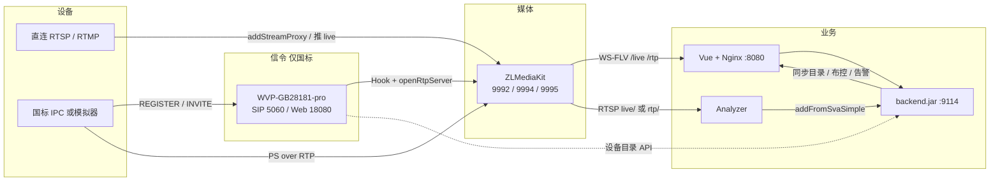

# easySVA / Video-Analyse — 项目速览

给后来者（含 Claude / Fable）快速建立心智模型。细节以本文件链接的文档为准；日期快照 **2026-09-08**。

GitHub：https://github.com/GaiYa0/Video-Analyse

---

## 这是什么

课程小组在开源 **easySVA**（视频安全生产分析）上做二次开发。界面标题是 **AI视频安全生产分析系统**。

原系统已经能：直连摄像头进 ZLMediaKit、网页预览、YOLO 布控与告警。本组增量主要是两块：

1. **睡岗检测**：YOLO-Pose 俯仰角 + 多帧时序（课件算法是睡岗，不是跌倒）。
2. **GB28181 国标接入**：国标摄像头（或模拟器）经 SIP 注册后，和直连设备走**同一套** Analyzer 与告警。

当前阶段 `docs/当前阶段.md` 里 **`phase: 4`**：P1 原系统、P2 睡岗、P3 国标（水杯模拟器主路径）已关账；正在做双源联调与交付材料。本组 **没有真机 IPC**。

上游四个 Gitee 仓（日常开发只走本 GitHub monorepo）：

| 本仓库目录 | 上游 | 技术 |
| --- | --- | --- |
| `backend/` | [SVA-backend](https://gitee.com/andersonwu/SVA-backend) | 若依 / Spring Boot，`:9114` |
| `web/` | [SVA-web](https://gitee.com/andersonwu/SVA-web) | Vue 2 + Element UI |
| `server/` | [SVA-server](https://gitee.com/andersonwu/SVA-server) | C++ Analyzer |
| `mediaServer/` | [SVA-mediaServer](https://gitee.com/andersonwu/SVA-mediaServer) | ZLMediaKit |

安装脚本仍在 [easySVA](https://gitee.com/andersonwu/easySVA)，不要把那个仓当开发目录。课件若检查 Star，给以上仓点即可。见 [architecture.md](./architecture.md)「上游仓库」。

---

## 总架构

课件五层：

```text
监控设备 → ZLMediaKit → SVA-server（C++ Analyzer）→ SVA-backend → Vue
```

和课件图的关键差别：

- Analyzer **向 ZLM 拉流**（RTSP `:9994`），不是 ZLM 专线吐帧。
- 浏览器预览是 **WS-FLV**，经 Nginx 反代，不直连 ZLM `:9992`。
- 本组这套 ZLM **没有内置国标 SIP UAS**。5060 上的注册 / 目录 / 点播由外挂的开源 **WVP** 承担；ZLM 只收媒体、转封装。
- 国标设备进业务库是 **backend 调 WVP 目录 + ZLM REST**，不是 Analyzer 去同步。
- 数据库是 **MariaDB 3307**（演示机 3306 已被占用）。



两条取流名要分清：

| 源 | ZLM app | 预览（Nginx） | Analyzer `streamUrl` |
| --- | --- | --- | --- |
| 直连 / 工位 | `live/<ape_id>` | `/live/` | `rtsp://127.0.0.1:9994/live/<ape_id>` |
| 国标 | `rtp/<设备_通道>` | `/rtp/` | `rtsp://127.0.0.1:9994/rtp/<设备_通道>` |

**在线**看 SIP 是否注册；**有没有画面**看点播出没出流。不要把「ZLM 里还有 rtp」当成设备在线。

---

## 开源 WVP 怎么接进来

本仓库 **不内嵌** WVP 源码。国标信令用的是开源项目 **[wvp-GB28181-pro](https://github.com/648540858/wvp-GB28181-pro)**（国标视频平台：SIP 接入、目录、点播，并把媒体交给 ZLM）。

演示机上的布局：

| 项 | 值 |
| --- | --- |
| 源码 | `/opt/wvp-GB28181-pro`（JDK **21** 编译） |
| 运行 | `/opt/SVA/wvp/`，`wvp-pro-*.jar`，profile `easysva` |
| Web / API | `http://127.0.0.1:18080/`（默认不对局域网开放） |
| 账号 | `admin` / `SvaDemo@2026`（与业务页账号不同） |
| SIP | 局域网 IP:**5060**（不是 `0.0.0.0` / `127.0.0.1`） |
| 平台 ID / 域 | `34020000002000000001` / `3402000000` |
| 设备密码 | `12345678` |
| 库 | 同机 MariaDB，库名 `wvp`；Redis DB **7** |
| 对接 ZLM | `127.0.0.1:9992`，`secret` 与 ZLM `[api] secret` 一致 |

本仓库里和 WVP 相关的是 **接线脚本与业务同步**，不是二次开发 WVP 内核：

- `scripts/setup_wvp.sh` / `start_wvp.sh` / `build_wvp.sh` / `build_wvp_web.sh`
- `scripts/wvp-ui/`：给 WVP 管理页注入 easySVA 石墨皮肤
- backend：`IGb28181DeviceSyncService`，接口 `POST /waring/device/syncGb28181`
- 前端设备管理：「同步国标设备」按钮

职责切分：

| 组件 | 做什么 | 不做什么 |
| --- | --- | --- |
| WVP | REGISTER / 保活 / Catalog / 点播 INVITE；指挥 ZLM 开 RTP 口 | 不管像素、不做 YOLO |
| ZLM | 收 PS/RTP，转 FLV/RTSP；`app=rtp` 与直连 `app=live` 分开 | 不管 SIP 5060 |
| easySVA 业务 | 同步 **已经在 WVP 里注册成功** 的通道；预览 / 布控 | 自己做国标注册 |
| Analyzer | 拉 ZLM 上的 `rtp/…` 做检测 | 设备目录、SIP |

点播链路：业务预览或布控 `warmRtp` → 若 ZLM 还没有该流 → hook **`on_stream_not_found`** → WVP INVITE → 模拟器/IPC 推 PS。无人观看约 60s 关流。多端口时 ZLM 可能先用 SSRC hex 当流名，要靠 WVP **`on_publish` 的 `stream_replace`** 改成 `设备_通道`；业务和 Analyzer 认的是命名流，不是 hex。

`seed_wvp_device.sh` 只写库、不是真注册，点播会黑屏。

更细的用法：[国标功能使用说明书.md](./国标功能使用说明书.md)；部署：[deploy-notes.md](./deploy-notes.md) §10.1。

---

## 仓库目录

```text
backend/          Java 业务：设备、布控、告警、调 ZLM、同步 WVP
web/              Vue：大屏 /dping、设备、布控、告警
server/           C++ Analyzer：原 YOLO + on_sleep_pose
mediaServer/      ZLMediaKit 源码与 conf（演示机运行在 /opt/SVA/mediaServer）
scripts/          演示机开机、WVP、国标模拟器、保栈
docs/             架构、启动、国标说明书、算法、截图
algo/sleep-pose/  睡岗 Python 原型（与 C++ 公式对齐）
```

演示机：仓库常见 `E:\video-analysis\Video-Analyse-main`；进程产物 `/opt/SVA/`。Apple 芯片 Mac **编不了**官方 Linux x86_64 安装包，只写 `web/` / `backend/` / 文档。

---

## 业务功能（用户能看见的）

| 模块 | 说明 |
| --- | --- |
| 大屏 `/dping` | 监测点、处置、历史报警 / 实时监控、待处理报警、统计。石墨深色 `#0e1116`。效果图 `docs/photo/pr8新主界面.png` |
| 设备管理 | 直连 RTSP 与国标分行；在线状态；同步国标；预览；启动/停止监控 |
| 布控 | 选设备与算法（原 YOLO 或睡岗）、画区域、行为规则；录像引擎用算法服务器 |
| 告警 | 原 YOLO 进区/数量阈值 + 睡岗类型徽章；截图与证据视频 |

业务页账号：`admin` / `admin123`。A 本机 `http://localhost:8080/`；局域网必须带 **`:8080`**。Clash 开着时不要用局域网 IP 的 `:80`。

### 直连

设备填 `direct_source_url` → backend `addStreamProxy` → `live/<流名>`。工位常用摄像头 RTMP 推到 `9995/live/…`。

### 国标演示设备（业务库只留这一条）

| 项 | 值 |
| --- | --- |
| 名称 | **demo-ipc** |
| `ape_id` | `camgbf0b09a04` |
| `device_type` | `gb28181` |
| 国标编码 | `34020000001320000001`（设备=通道） |
| ZLM stream | `34020000001320000001_34020000001320000001` |

现场无真机时用 `scripts/gb28181_sim.py`：真 SIP REGISTER（Contact `:15060`），ffmpeg 推 MPEG-2 PS。默认片源 `monisleep.mp4`。模拟器长推约每 60s 可能闪几秒，前端会自愈。

### 原 YOLO（保留，未替换）

算法如 `on_yolo11n_80`。进区、数量阈值等原行为仍可用。不要和睡岗混成一个算法。

### 睡岗

| 项 | 值 |
| --- | --- |
| 算法代号 | `on_sleep_pose` |
| 模型 | `yolo11n-pose.onnx`（不进 git） |
| 行为 / 告警 | `sleep_on_duty` / `SLEEP_ON_DUTY`（展示名「睡岗」） |
| 判定 | 俯仰角 ≥ **32°**（无髋 38°），连续 **5 秒**；正脸看镜头封顶 18° 不报 |
| 国标 | **同一套公式**，只换 URL：`live/` → `rtp/<设备_通道>` |

原系统里还有启发式行为类型 `sleep`（框宽高比 + 低速），**不是**本课的睡岗。告警仍走 `POST /waring/waring/addFromSvaSimple`（`control_code` / `image_path` 等），睡岗叠加类型字段。公式全文：[algorithm-sleep.md](./algorithm-sleep.md)。布控页默认时长框目前是 **2500ms**、角度 **32**；Analyzer 无规则时默认 5 秒。

2026-09-08 演示机联调：国标出框、国标睡岗、直连睡岗、直连原 YOLO 回归均已通过。

---

## 进程与端口

| 进程 | 端口 | 作用 |
| --- | --- | --- |
| Nginx | 80，对外常 **8080** | 静态页；`/prod-api/` → 9114；`/live/` `/rtp/` → ZLM 9992 |
| backend.jar | 9114 | 设备 / 布控 / 告警 / ZLM / 国标同步 |
| MariaDB | 3307 | 业务库 `easySVA` + WVP 库 `wvp` |
| Redis | 6379 | 业务缓存；WVP 用 DB 7 |
| ZLM | HTTP **9992** / RTSP **9994** / RTMP **9995** | 收流、转协议 |
| Analyzer | 被 backend 调 | 解码、YOLO、睡岗、上报 |
| WVP | Web **18080** / SIP **5060** | 国标信令 |
| `gb28181_sim.py` | Contact **15060** | 假 IPC |

`zlm_server.host` 保持 `127.0.0.1`。局域网看预览：A 可跑 `rewrite_play_url_for_lan.sh <LAN>`；前端也可把 `/live/`、`/rtp/` 的 FLV origin 改成当前页 host（见近期 #70）。`/analyzer/` 算法叠加流没有同等反代。

---

## 怎么把栈拉起来

推荐（Windows PowerShell，仓库根）：

```powershell
.\scripts\start_demo.ps1 -WithGbSim
```

顺序：业务栈（库 / Redis / Nginx / backend / ZLM / Analyzer）→ WVP → 国标模拟器。保栈：`scripts/check_demo_stack.sh`，双源加 `--dual-sleep --live <工位ape_id> --rtp 34020000001320000001_34020000001320000001`。命令细节只看 [启动手册.md](./启动手册.md)，不要另编一套。

---

## 前端结构（现网）

- `web/src/views/dping/`：大屏
- `web/src/views/device/manage.vue`：设备（含国标同步、预览）
- `web/src/views/deployment/`：布控工作台（预览 + 画几何 + 规则）
- `web/src/utils/flvPlayer.js`：FLV 创建 / 销毁 / 局域网 origin 改写
- 视觉令牌：`--sva-bg #0e1116`、`--sva-surface #161b22`、强调 `#6b9bb8`（石墨控制室，不是霓虹模板）

近期前端（#70，以 GitHub 是否已合入为准）：监测点跳 `/device/manage`；预览弹窗不被侧栏切字；操作列左右 6px；大屏底板从藏青 `rgb(3,7,40)` 收到石墨 `#0e1116`。

---

## 文档地图

每类内容只写一份，互相链接，不要再开新 md。

| 文件 | 内容 | 谁维护 |
| --- | --- | --- |
| [当前阶段.md](./当前阶段.md) | `phase` 与已关账事实 | C 关账 |
| [使用手册.md](./使用手册.md) | **给评委 / 新用户**：网页怎么用、两个亮点怎么看懂、常见现象 | C |
| [答辩PPT大纲.md](./答辩PPT大纲.md) / [答辩PPT生成稿.md](./答辩PPT生成稿.md) | 答辩结构、逐页正文与讲稿、Q&A、现场急救（可直接喂 AI 生成 PPT） | C 合稿，A/B 供片段 |
| [slides/index.html](./slides/index.html) | 成品 HTML 答辩幻灯片（24 页，P1→P4 + 创新与优化，浏览器直接打开，←/→ 翻页；讲稿在每页 `<!-- 备注 -->` 里） | C |
| [architecture.md](./architecture.md) | 总图、表、告警 JSON、走通步骤、上游仓库 | C |
| [启动手册.md](./启动手册.md) | 演示机开机 / 关栈 / 自检 / 网页地址 | A |
| [国标功能使用说明书.md](./国标功能使用说明书.md) | WVP×ZLM 原理、demo-ipc、怎么看画面、真机接入、故障 | A |
| [deploy-notes.md](./deploy-notes.md) | 演示机部署深水区与历史 | A |
| [algorithm-sleep.md](./algorithm-sleep.md) | 睡岗公式；§7 双源实测 | B |
| [architecture-analyzer.md](./architecture-analyzer.md) | Analyzer 取流与编译；§11 国标 URL | B |
| [fixtures/README.md](./fixtures/README.md) | 测试视频、国标 YOLO 验证步骤 | B |
| [photo/](./photo/) | P2/P3/大屏截图 | — |
| [分工.md](./分工.md) / [roles/](./roles/) / [PR规范.md](./PR规范.md) | 三人机器与可写路径、PR 规则（协作约定，不是架构的一部分） | 不随意改 |

---

## 协作与近期 PR（了解进度用）

三人：A 演示机与流媒体（bsZhang0904）、B 算法与 Analyzer（murd3r17）、C 前后端与合稿（GaiYa0）。PR 规范见 [PR规范.md](./PR规范.md)。

| PR | 状态（2026-09-08） | 内容 |
| --- | --- | --- |
| [#68](https://github.com/GaiYa0/Video-Analyse/pull/68) | 已合 | 双源睡岗实测写入 algorithm-sleep §7 |
| [#67](https://github.com/GaiYa0/Video-Analyse/pull/67) [#66](https://github.com/GaiYa0/Video-Analyse/pull/66) | 已合 | 一键演示、保栈、默认片源 |
| [#70](https://github.com/GaiYa0/Video-Analyse/pull/70) | 已合 | 设备预览布局、局域网 FLV、大屏石墨底板 |
| [#69](https://github.com/GaiYa0/Video-Analyse/pull/69) | 已合 | 保留 `on_publish` 做 `stream_replace`；`push-authority: false` 避免 live RTMP 401 |

查最新：`gh pr list --repo GaiYa0/Video-Analyse`。
