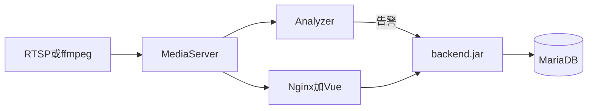

# 系统架构分析（验收点 1）

同学 C 合稿。流媒体细节只链 A 的 [architecture-streaming.md](./architecture-streaming.md)（[PR #1](https://github.com/GaiYa0/Video-Analyse/pull/1)），不在此重复。分析器细节待 B 补齐后链到本节。阶段见 [当前阶段.md](./当前阶段.md)。

## 仓库与进程

```text
backend/     Java :9114          web/          Vue + Nginx :80
server/      C++ Analyzer     mediaServer/  ZLMediaKit
```



端口与启动以 A 的 [deploy-notes.md](./deploy-notes.md) 为准（本组 MariaDB 3307，ZLM 9992/9994/9995，`admin` / `admin123`）。

## 数据流

设备管理保存直连 URL → backend 调 ZLM `addStreamProxy` → 预览走 WS-FLV → 布控启动后 Analyzer 拉同一路流做原 YOLO → `POST /waring/waring/addFromSvaSimple` 写入告警和截图 → 报警列表展示。时序与 ffmpeg 无摄像头拓扑见 A 的流媒体章。

## 三张表（C 从代码整理）

国标字段、睡岗类型 phase 1 不改表。

**设备 `h_device`**（`HDevice.java`，页面 `web/src/views/device/index.vue`、`realtime.vue`）：`ape_id`、`name`、`stream_source_type`、`direct_source_url`、`play_url`、`zlm_proxy_key`、`zlm_server_id`、`sva_server_id`、`is_online`、`monitor_status`。

**布控 `deployment_task`**（`DeploymentTask.java`，页面 `web/src/views/deployment/`）：`deployment_id`、`device_id`、`algorithm_code`、`target_code`、`geometry_config`、`stream_url`、`status`。

**告警 `h_waring`**（`HWaring.java`，页面 `web/src/views/warning/index.vue`）：`alarm_type`、`device_id`、`alarm_time`、`picture_url`、`is_handle`、`sva_behavior_type`。

## 验收走查（老师按此点，截图在 PR #1 的 `docs/photo/`）

1. 演示机启动服务，浏览器打开后台，`admin` / `admin123`。
2. 设备管理新增直连设备（无摄像头示例 `rtmp://127.0.0.1:9995/live/test1`），启动监控，预览有画面。
3. 布控选原 YOLO（本组 `yolo11n_80` + 目标如 `cup`），画区域后启动。
4. 报警列表出现记录和截图。
5. 三人已给 Gitee 上游五仓点 Star。本阶段没有国标、没有睡岗。

## 后面改哪里（不写实现）

- 睡岗：B 改 `server/`；C 改告警类型、布控选项、告警页。
- 国标：A 改 ZLM SIP 与同步接口；C 改设备表与列表。
