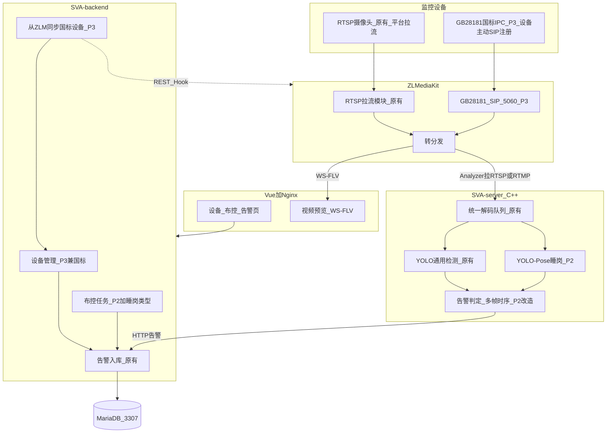

# 系统架构分析

同学 C 合稿。流媒体端口与实测细节见 [architecture-streaming.md](./architecture-streaming.md)、[deploy-notes.md](./deploy-notes.md)。阶段禁令见 [当前阶段.md](./当前阶段.md)。

五层与课件一致：**监控设备 → ZLMediaKit → SVA-server（C++）→ SVA-backend → Vue**。紫色为原系统（P1 必须跑通），蓝色为学生增量（按 phase 点亮，不是已经做完）。

课件算法是 **睡岗**（YOLO-Pose + 多帧时序），不是跌倒。国标设备进业务库是 **backend 调 ZLM REST/Hook**，不是 Analyzer 去同步。

## 总图（终态，按 phase 点亮）



| 阶段 | 图上要亮的部分 |
| --- | --- |
| P1 已完成 | RTSP/直连 → ZLM 拉流 → WS-FLV 预览；Analyzer 原 YOLO；backend 告警入库；Vue 原页面 |
| P2 当前 | Pose 睡岗 + 时序防误报；布控增加睡岗类型；告警页展示睡岗 |
| P3 | SIP 5060、国标 IPC；backend 从 ZLM 同步设备；列表区分 RTSP/国标；Analyzer 向 ZLM 取播放 URL |

P1 已过，正在做睡岗。国标仍禁止。已知布控详情可能 `live-output` 404，**以报警列表为准**；C 在改告警/布控页时可顺手修，不要顺手做国标。

## 和常见画法的差别（按这个实现）

- Analyzer **向 ZLM 拉流**，不是 ZLM 专线吐帧。
- 预览用 **WS-FLV**（本组 ZLM HTTP 9992，RTSP 9994，RTMP 9995），不是只写 FLV。
- 国标同步：A 写 ZLM 客户端，C 做设备表和「同步」按钮；Analyzer 不负责设备目录。
- 睡岗判定：关键点 → 头部俯仰角 → 连续多帧，再走原告警 HTTP；原 YOLO 保留。
- 库是 **MariaDB**（演示机 3307，因宿主机占了 3306）。

## 仓库与进程

```text
backend/     Java :9114          web/          Vue + Nginx :80
server/      C++ Analyzer     mediaServer/  ZLMediaKit
```

登录 `admin` / `admin123`。无摄像头时 ffmpeg 推 `rtmp://127.0.0.1:9995/live/test1`，见 A 的流媒体章。

## P1 数据流

设备管理保存直连 URL → backend `addStreamProxy` → 预览 WS-FLV → 布控启动后 Analyzer 拉同一路流做原 YOLO → `POST /waring/waring/addFromSvaSimple` → 报警列表。

## 三张表

P2 只动布控选项和告警类型，**不要改国标设备字段**。

**设备 `h_device`**（`HDevice.java`，`web/src/views/device/`）：`ape_id`、`name`、`stream_source_type`、`direct_source_url`、`play_url`、`zlm_proxy_key`、`zlm_server_id`、`sva_server_id`、`is_online`、`monitor_status`。P3 再加类型/国标 ID。

**布控 `deployment_task`**（`DeploymentTask.java`，`web/src/views/deployment/`）：`deployment_id`、`device_id`、`algorithm_code`、`target_code`、`geometry_config`、`stream_url`、`status`。P2 再加睡岗选项。

**告警 `h_waring`**（`HWaring.java`，`web/src/views/warning/index.vue`）：`alarm_type`、`device_id`、`alarm_time`、`picture_url`、`is_handle`、`sva_behavior_type`。P2 再加睡岗类型。

## 验收走查

截图在 `docs/photo/`（同学 A 已提交）。

1. 演示机启动服务，打开后台。
2. 新增直连设备，启动监控，预览有画面。
3. 布控原 YOLO（本组 `yolo11n_80` + 如 `cup`），画区域后启动。
4. 报警列表有记录和截图。
5. 三人已给 Gitee 上游五仓点 Star。

## 后面改哪里

- 睡岗：B 改 `server/`（Pose + 时序）；C 改告警类型、布控选项、告警页。
- 国标：A 改 SIP 与 ZLM 同步接口；C 改设备表与列表；B 让 Analyzer 取国标播放 URL。
