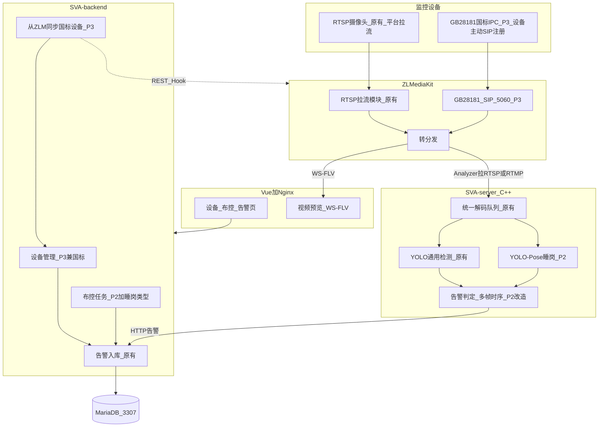

# 系统架构分析

小组一份架构文：总图与表由同学 C 整理，直连流媒体实测由张柏烁并入。启动步骤只看 [deploy-notes.md](./deploy-notes.md)。阶段禁令看 [当前阶段.md](./当前阶段.md)。

五层与课件一致：**监控设备 → ZLMediaKit → SVA-server（C++）→ SVA-backend → Vue**。紫色为原系统（P1 已跑通），蓝色为学生增量（按 phase 点亮）。

课件算法是 **睡岗**（YOLO-Pose + 多帧时序），不是跌倒。国标设备进业务库是 **backend 调 ZLM REST/Hook**，不是 Analyzer 去同步。

## 总图（终态，按 phase 点亮）



| 阶段 | 图上要亮的部分 |
| --- | --- |
| P1 已完成 | RTSP/直连 → ZLM 拉流 → WS-FLV 预览；Analyzer 原 YOLO；backend 告警入库；Vue 原页面 |
| P2 已完成 | Pose 睡岗 + 时序防误报；布控增加睡岗类型；告警页展示睡岗 |
| P3 当前 | SIP 5060、国标 IPC；backend 从 ZLM 同步设备；列表区分 RTSP/国标；Analyzer 向 ZLM 取播放 URL |

P2 已过，正在做国标。睡岗与原 YOLO 保留。布控详情 `POST /deployments/{id}/live-output` 已补，返回已有 `algorithmStreamUrl`；同学访问演示机用 `http://<IP>:8080/`（先关 Clash/VPN）。

## 和课件图的差别

- Analyzer **向 ZLM 拉流**，不是 ZLM 专线吐帧。
- 预览用 **WS-FLV**（本组 ZLM HTTP 9992，RTSP 9994，RTMP 9995），不是只写 FLV。
- 国标同步：A 写 ZLM 客户端，C 做设备表和「同步」按钮；Analyzer 不负责设备目录。
- 睡岗判定：关键点 → 头部俯仰角 → 连续多帧，再走原告警 HTTP；原 YOLO 保留。
- 库是 **MariaDB**（演示机 3307）。

## 仓库与进程（本组路径）

```text
backend/     Java :9114          web/          Vue + Nginx :80
server/      C++ Analyzer     mediaServer/  ZLMediaKit
```

| 组件 | 路径 | 作用 |
| --- | --- | --- |
| ZLMediaKit | `/opt/SVA/mediaServer/MediaServer` | 拉流、转协议、HTTP-FLV/RTSP |
| 后端 | `/opt/SVA/backend/backend.jar` | 设备、布控、调 ZLM、存告警 |
| Analyzer | `/opt/SVA/server/Analyzer` | 拉流、YOLO、上报告警 |
| Nginx | 系统包 | `dist` + `/prod-api/` → 9114；`/live/` → ZLM 9992 |
| MariaDB | 端口 3307 | 设备、布控、`zlm_server` |

登录 `admin` / `admin123`。

## 直连设备数据流（张柏烁实测）

### 添加设备

1. 设备管理填写 **视频流地址** `direct_source_url`，类型为直连。
2. 后端按 `zlm_server_id` 读 `zlm_server`（host、api_port、secret、app）。
3. 调用 ZLM **addStreamProxy**，把用户 URL 拉成 `live/<stream>`（stream 名由设备编码生成）。

```text
用户填写 rtmp://127.0.0.1:9995/live/test1
  → GET http://127.0.0.1:9992/index/api/addStreamProxy?app=live&stream=<流名>&url=...
  → ZLM 持有代理流，供预览与 Analyzer 再拉
```

### 启动监控与预览

启动监控后后端更新 `monitor_status`。预览接口返回 **WS-FLV**（如 `ws://127.0.0.1:9992/live/<stream>.live.flv`），页面 `flv.js` 播放。走的是 ZLM **9992**，不是原始 RTSP。

### 布控与 Analyzer

布控选设备、算法（如 `yolo11n_80`）、目标（如 `cup`）、数量阈值 + 直接告警、`geometryConfig`（主区域 ≥3 点）。启动后 backend 把 ZLM 侧可拉 URL、区域、规则发给 Analyzer。Analyzer 拉流 → ONNX/YOLO → 规则命中 → `POST http://127.0.0.1:9114/waring/waring/addFromSvaSimple` → `h_waring` + 截图。配置：`/opt/SVA/config.json`（`host=127.0.0.1`，`mediaRtspPort=9994`）。

### ZLM 端口（安装脚本未用 554）

| 协议 | 端口 | 示例 |
| --- | --- | --- |
| HTTP API / HTTP-FLV | 9992 | `http://127.0.0.1:9992/index/api/...` |
| RTSP | 9994 | `rtsp://127.0.0.1:9994/live/test1` |
| RTMP | 9995 | `rtmp://127.0.0.1:9995/live/test1` |

查流：`curl -s "http://127.0.0.1:9992/index/api/getMediaList?secret=<与 zlm_server.secret 及 config.ini [api] secret 一致>"`

### 在线状态

`h_device.is_online` / `monitor_status` 由后端结合 ZLM 代理流是否存活、监控启停更新。ZLM 用 `getMediaList`。直连设备不经过 SIP。

### 无摄像头测试

```text
ffmpeg 循环 cup.mp4 → RTMP 推到 ZLM :9995 live/test1
  → 设备 direct_source_url = rtmp://127.0.0.1:9995/live/test1
  → 预览 WS-FLV；Analyzer 拉流 YOLO 检 cup → 告警
```

### 截图与 Nginx

磁盘 `/var/www/SVA-web/upload/alarm/`，URL 前缀 `/alarm/`。`config.json` 的 `uploadDir` 为 `/var/www/SVA-web/upload`。

```text
zlm_server: host=127.0.0.1, api_port=9992, media_http_port=9992, media_rtsp_port=9994, app=live
nginx: location /prod-api/ → 9114；location /live/ → 9992（HTTP-FLV/WS-FLV）；location /alarm/ → upload/alarm/；root dist/
zlm_server.host 必须保持 127.0.0.1（Analyzer / 后端 API 用）。同学看流走 Nginx `/live/`，不要把 host 改成局域网 IP。
```

睡岗不改变「流如何进 ZLM」这条路径，只改 Analyzer 判定和告警类型。国标在 P3 开 SIP 5060。

## 三张表

P2 只动布控选项和告警类型，**不要改国标设备字段**。

**设备 `h_device`**（`HDevice.java`，`web/src/views/device/`）：`ape_id`、`name`、`stream_source_type`、`direct_source_url`、`play_url`、`zlm_proxy_key`、`zlm_server_id`、`sva_server_id`、`is_online`、`monitor_status`。P3 再加类型/国标 ID。

**布控 `deployment_task`**（`DeploymentTask.java`，`web/src/views/deployment/`）：`deployment_id`、`device_id`、`algorithm_code`、`target_code`、`geometry_config`、`stream_url`、`status`。P2 算法编码 `on_sleep_pose`（下拉仍读 `av_algorithm`，原 YOLO 不要改名）。

**告警 `h_waring`**（`HWaring.java`，`web/src/views/warning/index.vue`）：`alarm_type`、`device_id`、`alarm_time`、`picture_url`、`is_handle`、`sva_behavior_type`。P2 睡岗：`alarm_type=SLEEP_ON_DUTY`，`alarm_type_name=睡岗`，`sva_behavior_type=sleep_on_duty`。不改 `h_device` 国标字段。

## 验收走查

截图在 [docs/photo/](./photo/)。

1. 演示机启动服务，打开后台。
2. 新增直连设备，启动监控，预览有画面。
3. 布控原 YOLO（本组 `yolo11n_80` + 如 `cup`），画区域后启动。
4. 报警列表有记录和截图。
5. 三人已给 Gitee 上游五仓点 Star。

P2 睡岗（2026-09-02 演示机走查，已关账）：

- 布控选 `on_sleep_pose`、闭合主区域、规则 `sleep_on_duty`（低头 ≥32° / 2500ms），趴桌后弹出睡岗推送：[p2睡岗检测布控.png](./photo/p2睡岗检测布控.png)
- 告警详情类型为睡岗 / `SLEEP_ON_DUTY`，规则 ID `sleep_on_duty_default`：[p2睡岗检测告警详情.png](./photo/p2睡岗检测告警详情.png)
- 同机原 YOLO 进区告警仍可用（CCTV5 / `behavior_rule_1`）：[p2原YOLO进区告警.png](./photo/p2原YOLO进区告警.png)

## 后面改哪里

分析器取流、模型与现网告警 POST 见 [architecture-analyzer.md](./architecture-analyzer.md) §6.2。入口不变：`POST /waring/waring/addFromSvaSimple`。设备由 `control_code` 反查布控，不靠 `deviceId` 入库。

现网字段（B 已写明）：

```json
{
  "control_code": "<deploymentId>",
  "behavior_type": "",
  "rule_id": "",
  "desc": "",
  "video_path": "alarm/.../main.mp4",
  "image_path": "alarm/.../main.jpg"
}
```

睡岗叠加（命中任一即入库为睡岗；不要把 BehaviorEvaluator 里名为 `sleep` 的启发式当成 P2）：

- `alarmType` / `alarm_type` = `SLEEP_ON_DUTY`
- 或 `behavior_type` = `sleep_on_duty`
- 或 `customEventName` / `alarm_type_name` = `睡岗`
- `snapshotPath` 可作为 `image_path` 别名
- 可选 `confidence`、`pitchDegree`、`durationFrames`（`pitchDegree` 写入已有表新列 `sva_pitch_degree`；`durationFrames` 写入已有 `duration_ms`）

算法编码：`on_sleep_pose`，`object_str=person`。B 在 Analyzer `resolveAlgorithm` 认这个 code。A 在 MariaDB **3307** 执行一次（列不全时 `DESC av_algorithm` 再补 `sort`）：

```sql
INSERT INTO av_algorithm (code, name, state, sort, object_str)
SELECT 'on_sleep_pose', '睡岗检测', 0, 99, 'person'
WHERE NOT EXISTS (SELECT 1 FROM av_algorithm WHERE code = 'on_sleep_pose');

ALTER TABLE h_waring ADD COLUMN sva_pitch_degree DOUBLE NULL;
```

A 执行 `ALTER` 后需重启 `backend.jar`。列已存在时跳过。B 未合入 Pose 前，选睡岗启动会「不支持的算法」，这是预期。

- 睡岗：B 改 `server/`（Pose + 时序）；C 已改告警类型映射、布控选项默认值、`live-output`。
- 国标：A 改 SIP 与 ZLM 同步接口；C 改设备表与列表；B 让 Analyzer 取国标播放 URL。
