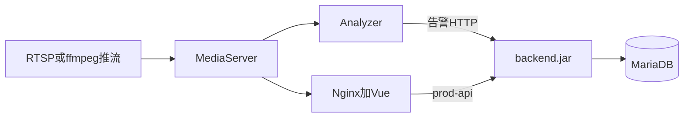
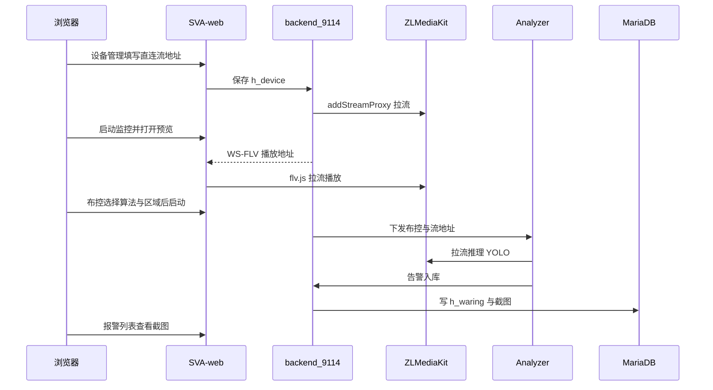

# 系统架构分析（验收点 1）

> 同学 C 合稿。流媒体细节见同学 A 的 [architecture-streaming.md](./architecture-streaming.md)（[PR #1](https://github.com/GaiYa0/Video-Analyse/pull/1)）。分析器细节待同学 B 补 [architecture-analyzer.md](./architecture-analyzer.md)。阶段禁令见 [当前阶段.md](./当前阶段.md)。

## 1. 分工与手册

**一句话：同学 A 守演示机并主攻国标流媒体，同学 B 主攻睡岗并和 A 完成 C++ 集成，同学 C 主攻前后端与合稿。**

- [分工.md](./分工.md)
- [A · 流媒体与演示机](./roles/A-流媒体与演示机.md)
- [B · 算法与分析器](./roles/B-算法与分析器.md)
- [C · 前后端与合稿](./roles/C-前后端与合稿.md)
- 给验收老师照做的步骤：[user-manual.md](./user-manual.md)

## 2. 仓库与进程拓扑

本仓是 GitHub monorepo，上游在 Gitee 四仓（见 [UPSTREAM.md](./UPSTREAM.md)）。

```text
Video-Analyse/
  backend/        SVA-backend   Java / 若依    :9114
  web/            SVA-web       Vue 管理端     Nginx :80
  server/         SVA-server    C++ Analyzer
  mediaServer/    SVA-mediaServer  ZLMediaKit
  docs/           协作与架构文档
```

演示机（同学 A，WSL2 Ubuntu 22.04）进程：



本组实测端口与路径以 [deploy-notes.md](./deploy-notes.md) 为准（MariaDB **3307**，ZLM **9992 / 9994 / 9995**，账号 `admin` / `admin123`）。

## 3. 端到端数据流（原系统 · phase 1）



文字版：设备 → ZLM → 预览走前端；同一路流给 Analyzer 做原 YOLO → 告警回 backend → 前端展示。细节、端口、无摄像头的 ffmpeg 推流拓扑见 A 的流媒体章，不在此重复。

## 4. 三张核心表（索引）

实体在 `backend/`，下面只列验收点 1 读代码时要对上的字段。国标字段、睡岗告警类型 **phase 1 不改表**。

### 4.1 设备 `h_device`

代码：`backend/ruoyi-admin/.../domain/HDevice.java`  
页面：`web/src/views/device/index.vue`（设备管理）、`device/realtime.vue`（实时监控/预览）

| 字段 | 含义（phase 1） |
| --- | --- |
| `ape_id` | 设备编码 |
| `name` | 设备名称 |
| `stream_source_type` | 源流类型（直连 DIRECT） |
| `direct_source_url` | 用户填写的 RTSP/RTMP 地址 |
| `play_url` | 给前端预览的地址 |
| `zlm_proxy_key` | ZLM 代理流标识 |
| `zlm_server_id` / `sva_server_id` | 绑定哪台 ZLM / Analyzer |
| `is_online` | 是否在线 |
| `monitor_status` | 监控启停 |

### 4.2 布控 `deployment_task`

代码：`backend/ruoyi-system/.../domain/DeploymentTask.java`  
页面：`web/src/views/deployment/index.vue`、`deployment/add.vue`

| 字段 | 含义（phase 1） |
| --- | --- |
| `deployment_id` | 任务号 |
| `device_id` | 关联设备 |
| `algorithm_code` / `algorithm_name` | 如 `yolo11n_80` |
| `target_code` | 检测目标（如 `cup`） |
| `geometry_config` | 识别区域多边形 |
| `stream_url` | 分析器用的拉流地址 |
| `status` | 启停状态 |

算法目录另有 `h_algorithm`（`HAlgorithm.java`），布控时从中选模型。

### 4.3 告警 `h_waring`

代码：`backend/ruoyi-admin/.../domain/HWaring.java`  
页面：`web/src/views/warning/index.vue`  
Analyzer 回调：A 文中的 `POST /waring/waring/addFromSvaSimple`

| 字段 | 含义（phase 1） |
| --- | --- |
| `w_id` / `id` | 告警主键 |
| `alarm_type` / `alarm_type_name` | 告警类型 |
| `device_id` / `device_name` | 来源设备 |
| `alarm_time` | 时间 |
| `picture_url` | 截图（磁盘见 A 文 `upload/alarm/`） |
| `is_handle` | 是否已处理 |
| `sva_behavior_type` / `sva_event_key` | Analyzer 侧事件信息 |

## 5. 分章链接

| 章节 | 负责人 | 文档 |
| --- | --- | --- |
| 部署与端口 | A | [deploy-notes.md](./deploy-notes.md) |
| 流如何进 ZLM、预览、在线状态 | A | [architecture-streaming.md](./architecture-streaming.md) |
| Analyzer 取流、模型路径、告警如何打到 backend | B | [architecture-analyzer.md](./architecture-analyzer.md)（待提交） |
| 页面走查与给老师的步骤 | C | [user-manual.md](./user-manual.md) |
| 验收截图 | A | `docs/photo/`（PR #1） |

## 6. 后续切入点（只写将改哪里）

- 睡岗：B 改 `server/` 推理；C 改 `h_waring` 类型与布控选项、告警页。不改 ZLM 主路径。
- 国标：A 改 ZLM SIP 与同步接口；C 改 `h_device` 类型字段与列表展示。Analyzer 向 ZLM 取播放 URL（B）。

## 7. Gitee Star（课件检查）

每人给上游点 Star： [easySVA](https://gitee.com/andersonwu/easySVA)、[SVA-backend](https://gitee.com/andersonwu/SVA-backend)、[SVA-web](https://gitee.com/andersonwu/SVA-web)、[SVA-server](https://gitee.com/andersonwu/SVA-server)、[SVA-mediaServer](https://gitee.com/andersonwu/SVA-mediaServer)。
