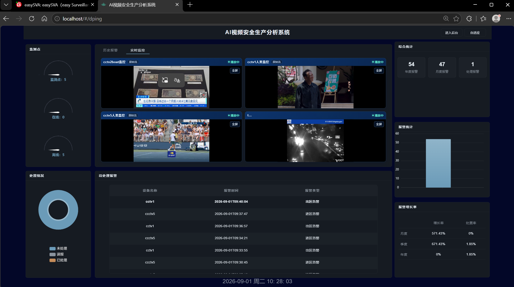
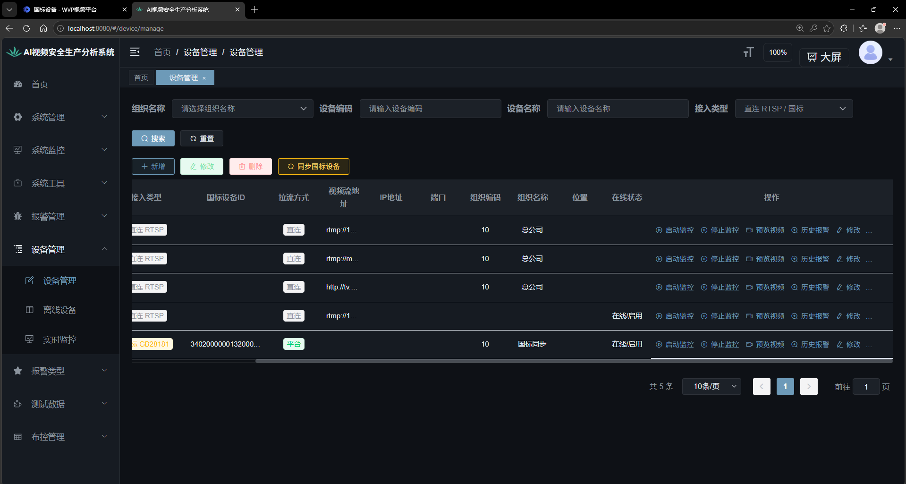
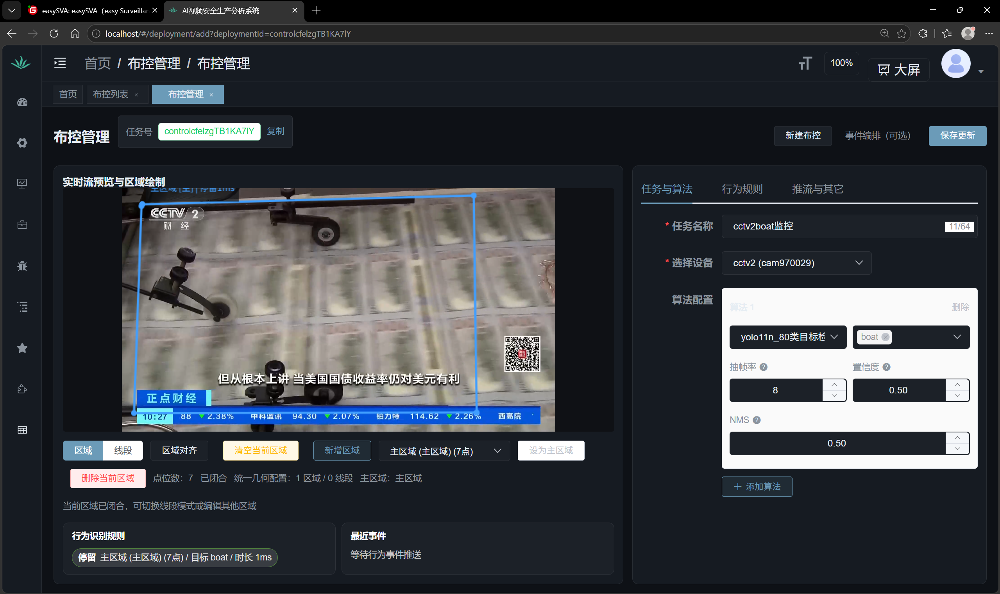
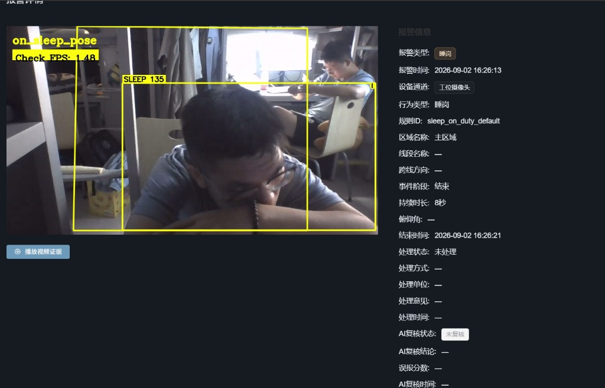

# AI 视频安全生产分析系统 · 使用手册（评委版）

面向评委老师与第一次接触本系统的人。只讲「打开网页后怎么用、看到什么、为什么这样」，不讲命令行。开机命令在 [启动手册.md](./启动手册.md)，架构细节在 [architecture.md](./architecture.md)，答辩幻灯片在 [slides/index.html](./slides/index.html)。

---

## 1. 一页看懂

本系统在开源 **easySVA** 之上做二次开发。摄像头画面进入平台后，由 AI 分析器实时检测，命中规则即产生告警，管理员在网页上查看、处置。

| 你能做的 | 在哪 | 一句话 |
| --- | --- | --- |
| 看画面 | 大屏 / 设备管理 → 预览视频 | 直连摄像头和国标摄像头都能看 |
| 布控检测 | 布控管理 | 选设备 + 选算法 + 画区域 + 定规则，启动后自动盯 |
| 查告警 | 报警管理 | 告警类型、截图、视频证据、处置记录 |

本组两项增量（课程验收重点）：

| 增量 | 解决什么 | 怎么看出来 |
| --- | --- | --- |
| **睡岗检测** | 工位人员趴桌 / 长时间低头睡觉，自动报警；短暂低头看键盘、看手机、正脸看屏幕**不报** | 布控算法选「睡岗检测」，告警类型显示 **睡岗** 徽章 |
| **GB28181 国标接入** | 国标摄像头（或模拟器）经 SIP 注册后，进入同一套设备表、同一套检测与告警 | 设备管理里「接入类型」显示 **GB28181**，一键「同步国标设备」 |

两类设备源、两类算法**共用**同一条推理与告警链路，只是取流地址不同。

---

## 2. 打开系统

| 页面 | 地址 | 账号 |
| --- | --- | --- |
| 业务系统（演示机本机） | `http://localhost:8080/` | `admin` / `admin123` |
| 业务系统（同一 Wi‑Fi 的其他电脑） | `http://<演示机IP>:8080/`（必须带 `:8080`） | 同上 |
| 国标平台管理页（仅演示机本机，排障用） | `http://127.0.0.1:18080/` | `admin` / `SvaDemo@2026` |

登录后先进入 **大屏**（地址栏 `/#/dping`），右上角「进入后台」进入管理页；后台右上角「大屏」可返回。

浏览器用 Chrome / Edge。若开着代理软件（Clash / VPN），演示机本机只用 `localhost`，其他电脑先关代理。

---

## 3. 界面导览

### 3.1 大屏



| 区块 | 含义 |
| --- | --- |
| 监测点（左上） | 设备总数 / 在线 / 离线，点击可跳到设备管理 |
| 实时监控（中上） | 多路实时画面，可全屏；旁边「历史报警」页签切换到告警回看 |
| 待处理报警（中下） | 最近未处置告警：设备、时间、类型 |
| 处置情况（左下） | 未处理 / 误报 / 已处理占比 |
| 综合统计、报警统计、报警增长率（右） | 年 / 月 / 处置量、按月柱状图、增长率 |

### 3.2 后台左侧菜单（本手册只用到加粗的四个）

| 菜单 | 用途 |
| --- | --- |
| 首页 | 概览 |
| **设备管理** → 设备管理 / 离线设备 / 实时监控 | 增删设备、同步国标、预览、启停监控；实时监控即「监控墙」 |
| **布控管理** | 新建 / 启动 / 停止布控任务，画区域，配算法与规则 |
| **报警管理** | 报警列表、报警详情、处置、误报标记 |
| **报警类型** | 告警类型字典（含本组新增的「睡岗」） |
| 系统管理 / 系统监控 / 系统工具 / 测试数据 | 若依框架自带，与本次验收无关 |

---

## 4. 五分钟走一遍（验收演示顺序）

```text
登录 → 设备管理（看两类设备、预览） → 布控（选算法、画区域、启动） → 报警管理（看告警与证据）
```

### 4.1 设备管理



列表关键列：

| 列 | 看什么 |
| --- | --- |
| 接入类型 | **直连 RTSP**（原系统方式，填流地址即可）或 **GB28181**（本组新增，国标注册接入） |
| 国标设备 ID | 只有国标行有值，20 位编码，如 `34020000001320000001` |
| 拉流方式 | 直连 / 平台 |
| 在线状态 | 直连看拉流是否成功；国标看 **SIP 是否注册成功**（在线 ≠ 一定有画面，见 §5.2） |
| 操作 | 启动监控 / 停止监控 / 预览视频 / 历史报警 / 修改 |

常用操作：

1. **新增直连设备**：点「新增」，填名称与视频流地址（RTSP / RTMP 均可），保存后点「启动监控」，再点「预览视频」。
2. **同步国标设备**：点黄色按钮「同步国标设备」，系统向国标平台读取**已注册成功**的通道并写入列表。演示机上会出现一条 **demo-ipc**。
3. **预览视频**：弹窗播放实时画面。直播流进度条显示 `0:00 / 0:00` 是正常的（没有片长）。

### 4.2 布控



进入「布控管理」→「新建布控」，右侧三个页签依次填：

| 页签 | 填什么 | 建议 |
| --- | --- | --- |
| 任务与算法 | 任务名称、选择设备、算法配置 | 原 YOLO：算法 `yolo11n_80` + 目标（如 `person` / `cup`）；**睡岗**：算法 `睡岗检测（on_sleep_pose）`，目标 `person` |
| 行为规则 | 进区 / 出区 / 停留 / 数量阈值 / **睡岗** 等 | 睡岗规则默认「低头 ≥ 32°、持续 2.5 秒」；原 YOLO 常用「数量阈值 + 直接告警」 |
| 推流与其它 | 录像引擎、是否推流、前端画框 | 录像引擎选 **算法服务器**，这样告警会带完整视频证据 |

左侧画面上画检测区域：点「区域」后在画面上点 ≥ 3 个点闭合，再「设为主区域」（也可直接点「区域对齐」用整幅画面）。

保存后回到「布控列表」，点该任务的 **启动**，状态变为 **RUNNING**。国标设备与直连设备的布控方式完全一样。

### 4.3 报警管理



- **报警列表**：默认只显示**当天**；看历史告警请把日期范围拉大或清空。
- 点任一条打开 **报警详情**：报警类型徽章（如 **睡岗** / 进区告警）、设备、行为类型、规则 ID、持续时长、截图；「播放视频证据」回看告警片段。
- 命中时右下角也会弹出实时告警推送。
- 处置：填处理方式 / 意见，或标为误报；大屏「处置情况」随之变化。

---

## 5. 两个亮点怎么看懂

### 5.1 睡岗检测

**判定原则**（一句话）：人体关键点算出**头部俯仰角**，低头 ≥ 32°（看不到髋部时 38°）并**持续 5 秒**才算睡岗；其间抬头超过 0.6 秒即清零。

为什么不误报：

| 常见动作 | 结果 | 原因 |
| --- | --- | --- |
| 趴桌、脸埋进手臂 | **报** | 角度 ≥ 32°，峰值到过 45°，头基本不动，持续足够久 |
| 低头看键盘、翻资料 | 不报 | 角度反复出入阈值，「低头占比」不到 80% |
| 低头看手机、写字 | 不报 | 头一直在动，超过位移上限 |
| 正脸对着屏幕 / 镜头 | 不报 | 正脸且头在脖子上方 → 角度封顶 18° |
| 人走开、被遮挡 | 不报 | 姿态丢失超过 1.2 秒即清零 |
| 背景里路过的人 | 不报 | 只对画在区域内的人计时 |

看画面上的框（布控预览或告警截图）：

| 框 | 含义 |
| --- | --- |
| 绿框 `UP 角度` | 坐直，不计时 |
| 橙框 `BOW 角度 秒数` | 已低头，正在计时 |
| 黄框 `SLEEP 角度 秒数` | 睡岗成立，产生告警 |

演示要点：人坐在已画好的区域内，**脸颊或额头落向桌面**（不是只低头看屏幕），框变 `BOW` 后稳住数秒，即出「睡岗」告警。截图：[p2睡岗检测布控.png](./photo/p2睡岗检测布控.png)、[p2睡岗检测告警详情.png](./photo/p2睡岗检测告警详情.png)。原有 YOLO 进区告警仍正常：[p2原YOLO进区告警.png](./photo/p2原YOLO进区告警.png)。

### 5.2 GB28181 国标接入

**一句话**：国标摄像头主动向平台**注册**（SIP），平台需要画面时向它**点播**，画面以 RTP 送到流媒体服务器，再给网页和分析器用。

| 角色 | 谁 | 干什么 |
| --- | --- | --- |
| 信令 | 开源国标平台 WVP（`:18080`，SIP `:5060`） | 注册、保活、目录、点播 |
| 媒体 | ZLMediaKit | 收国标码流，转成网页 FLV 与分析器 RTSP |
| 业务 | 本系统 | 「同步国标设备」把已注册通道写进设备表；预览 / 布控 / 告警与直连完全相同 |
| 分析 | Analyzer | 不碰 SIP，只是把拉流地址从 `live/<设备>` 换成 `rtp/<设备_通道>` |

看懂两个状态：

- **在线**：设备已向平台注册成功（能收到保活）。
- **有画面**：已经点播成功、码流已到。**在线但暂时黑屏**属于正常过渡：预览或布控会自动触发点播，一般数秒内出画；无人观看约 60 秒后流会自动关闭，再点预览即重新点播。

演示机参数：平台 ID `34020000002000000001`，域 `3402000000`，设备注册密码 `12345678`。演示设备 **demo-ipc**（国标编码 `34020000001320000001`）。

**现场没有真机怎么办**：本组用自研 **国标协议模拟器** 充当假摄像头——真 SIP 注册、真 INVITE 点播、真 PS/RTP 码流，只是画面来自一段工位视频文件。协议路径与真机完全一致；接真机只需在摄像机里填上表参数（详见 [国标功能使用说明书.md](./国标功能使用说明书.md) §10）。模拟器长时间推流约每分钟可能闪断几秒，页面会自动恢复，真机无此现象。

截图：[p3国标在线状态.png](./photo/p3国标在线状态.png)、[国标同步显示.png](./photo/国标同步显示.png)、[国标同步预览视频.png](./photo/国标同步预览视频.png)。

---

## 6. 现场常见现象与解释

| 现象 | 解释 / 处理 |
| --- | --- |
| 预览进度条 `0:00 / 0:00` | 直播流没有片长，正常 |
| 预览画面像定格 | 浏览器 `Ctrl + Shift + R` 强刷；国标模拟器偶发闪断会自愈 |
| 国标设备「在线」但预览黑几秒 | 正在点播，稍等；60 秒无人看会自动关流，再点即可 |
| 报警列表是空的 | 默认只看**今天**，把日期改到昨天～今天 |
| 布控启动后告警来得慢 | 睡岗需连续低头 5 秒（页面默认 2.5 秒）；国标第一次拉流要等点播，最多约 25 秒 |
| 网页 502 / 打不开 | 后端未起或代理软件拦截：演示机用 `localhost:8080`，其他电脑关 Clash、带 `:8080` |
| 其他电脑能开网页但预览黑 | 需要演示机把播放地址改写成局域网 IP（A 同学执行 `rewrite_play_url_for_lan.sh`） |
| 布控保存报「至少需要 3 点主区域」 | 先在画面上画闭合区域并设为主区域 |

---

## 7. 速查表

### 端口与组件

| 组件 | 端口 | 作用 |
| --- | --- | --- |
| Nginx | 80（局域网映射 8080） | 网页入口；反代 API 与视频流 |
| backend.jar（Spring Boot） | 9114 | 设备 / 布控 / 告警 / 国标同步 |
| MariaDB | 3307 | 业务库与国标平台库 |
| ZLMediaKit | 9992 / 9994 / 9995 | HTTP-FLV / RTSP / RTMP |
| Analyzer（C++） | 被后端调用 | YOLO、睡岗推理、告警上报 |
| WVP | 18080 / 5060 | 国标 Web 管理 / SIP 信令 |

### 验收阶段与成果

| 阶段 | 内容 | 状态 |
| --- | --- | --- |
| P1 | 原系统部署、直连预览、原 YOLO 布控与告警 | 已完成 |
| P2 | 睡岗算法（YOLO-Pose + 多帧时序）、布控与告警页支持 | 已完成 |
| P3 | GB28181 国标接入（WVP + ZLM），设备表区分两类源，同步按钮 | 已完成 |
| P4 | 两类设备源 × 两类算法联调、回归、交付材料 | 2026-09-08 联调通过 |

### 更多文档

| 想知道 | 看 |
| --- | --- |
| 项目速览（给协作 AI / 新成员） | [CLAUDE.md](./CLAUDE.md) |
| 架构总图、三张表、告警 JSON | [architecture.md](./architecture.md) |
| 演示机开机 / 关机 / 自检 | [启动手册.md](./启动手册.md) |
| 国标原理、真机接入、故障 | [国标功能使用说明书.md](./国标功能使用说明书.md) |
| 睡岗公式与阈值 | [algorithm-sleep.md](./algorithm-sleep.md) |
| 分析器内部 | [architecture-analyzer.md](./architecture-analyzer.md) |
| 答辩 PPT | [slides/index.html](./slides/index.html) |
