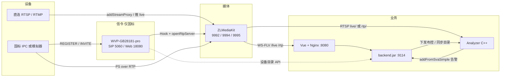
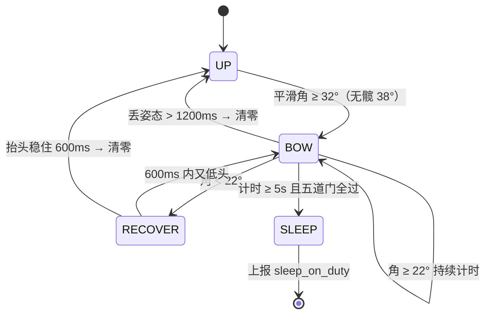
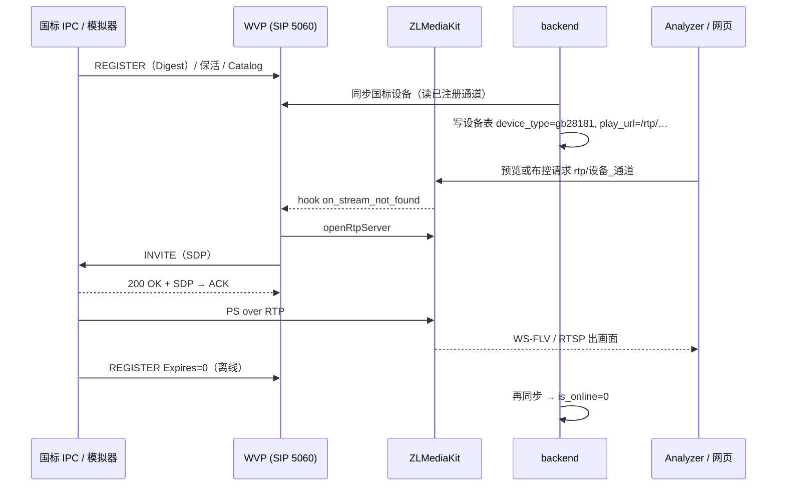

# 答辩 PPT 生成稿（可直接喂给 AI 生成 PPT）

> **给 AI PPT 工具的说明（复制整份文件即可）**
>
> 请按下面「第 N 页」逐页生成一份 **16:9、中文、约 18 页 + 2 页附录** 的答辩 PPT。
> - 风格：深色「石墨控制室」。背景 `#0e1116`，卡片 `#161b22`，强调色 `#6b9bb8`，正文浅灰 `#c9d1d9`，标题白色。克制、工程感，不要霓虹渐变和大面积插画。
> - 每页只放「正文」里的要点，字号不小于 18pt；「讲稿」放进演讲者备注，不要印在页面上；「视觉」是版式与配图建议，图片路径相对仓库 `docs/`，找不到图就用示意占位。
> - 出现 ```mermaid 代码块的地方，请渲染成流程图 / 时序图 / 状态图；渲染不了就按其含义画示意图。
> - 表格保留为表格。代码或标识符（如 `rtp/<设备_通道>`）用等宽字体。
>
> 大纲见 [答辩PPT大纲.md](./答辩PPT大纲.md)；名词解释见 [使用手册.md](./使用手册.md)。

---

## 第 1 页 · 封面

**正文**

- AI 视频安全生产分析系统 —— 睡岗检测与 GB28181 国标接入
- 基于开源 easySVA 的二次开发
- 小组成员：同学 A 张柏烁（演示机 · 流媒体 · 国标）｜同学 B（睡岗算法 · C++ 分析器）｜同学 C（前后端 · 仓库 · 文档统稿）
- 仓库：github.com/GaiYa0/Video-Analyse

**讲稿**

老师好。我们组的题目是在开源视频安全生产分析系统 easySVA 上做二次开发，重点两件事：睡岗检测算法，以及 GB28181 国标摄像头接入。我先讲整体，B 讲算法，A 讲国标和现场演示。

**视觉**

标题居中，底部一行三人分工。可用大屏截图 `photo/pr8新主界面.png` 做半透明底图。（B、C 姓名按实际填写：邹子轶 / 吴佳锴。）

---

## 第 2 页 · 目录

**正文**

1. 背景与起点：原系统能做什么
2. 总架构：两类设备源、一条推理链路
3. 睡岗检测：姿态几何 + 多帧时序
4. 国标接入：WVP 信令 + ZLM 媒体
5. 工程协作、踩过的坑、成果与展望
6. 现场演示

**视觉**

左侧竖排编号，右侧一句话说明。

---

## 第 3 页 · 项目背景

**正文**

- 安全生产场景：值班室、控制室、工位需要「有人在岗、没在睡觉」
- 课件给出的五层架构：**监控设备 → 流媒体 → C++ 分析器 → 后端 → 前端**
- 课程要求：在原系统上增加 **睡岗检测**，并让 **国标 GB28181** 摄像头接入
- 我们的原则：不推翻原系统，**复用同一条推理与告警链路，只换输入**

**讲稿**

课件规定了五层结构和两个增量方向。我们全程守住一条原则：不重写、不拆原 YOLO，新算法和新设备源都插到原有链路里。

**视觉**

五层横向流程图，左到右五个方块。

---

## 第 4 页 · 原系统能力（起点）

**正文**

| 目录 | 上游（Gitee） | 技术 | 职责 |
| --- | --- | --- | --- |
| `backend/` | SVA-backend | 若依 / Spring Boot `:9114` | 设备、布控、告警入库 |
| `web/` | SVA-web | Vue 2 + Element UI | 大屏、设备、布控、告警页 |
| `server/` | SVA-server | C++ Analyzer + ONNX Runtime | 拉流、YOLO 推理、告警上报 |
| `mediaServer/` | SVA-mediaServer | ZLMediaKit | 收流、转协议（FLV / RTSP） |

- P1 已跑通：直连 RTSP / RTMP → ZLM → 网页预览 → YOLO 布控 → 告警截图

**讲稿**

原系统四个仓，我们合成一个 GitHub monorepo。验收点 1 先在演示机把原路径全部跑通，作为基线。

**视觉**

表格 + 右侧两张小截图 `photo/初步搭建.png`、`photo/警告界面.png`。

---

## 第 5 页 · 本组增量一览

**正文**

| | 睡岗检测 | GB28181 国标接入 |
| --- | --- | --- |
| 解决什么 | 趴桌 / 长时间低头自动告警，短低头不误报 | 国标摄像头注册进平台，与直连设备同表同链路 |
| 新增在哪 | Analyzer 新算法 `on_sleep_pose`；布控页选项；告警类型「睡岗」 | 外挂开源 WVP 做 SIP；设备表 3 字段；「同步国标设备」；Analyzer 取流地址 |
| 没动什么 | 原 YOLO 模型与输出、告警入口 | 原直连路径、ZLM 配置结构 |
| 验收 | P2（2026-09-02） | P3（2026-09-07） |

- P4：两类源 × 两类算法交叉联调，2026-09-08 全部通过

**视觉**

两栏对比卡片。

---

## 第 6 页 · 总架构图

**正文**



- 数据库 MariaDB `3307`，缓存 Redis；网页经 Nginx `:8080`

**讲稿**

上面是直连，下面是国标。国标多了 WVP 做信令，媒体仍进同一个 ZLM；Analyzer 和后端对两类源的处理完全一致。

**视觉**

整页放图，端口用小字标注。

---

## 第 7 页 · 两条取流路径

**正文**

| 源 | 进 ZLM 的方式 | ZLM 流名 | 网页预览 | Analyzer 拉流 |
| --- | --- | --- | --- | --- |
| 直连 | 后端 `addStreamProxy` 或摄像头推 RTMP | `live/<ape_id>` | Nginx `/live/…live.flv` | `rtsp://127.0.0.1:9994/live/<ape_id>` |
| 国标 | SIP 点播后设备推 PS/RTP | `rtp/<设备_通道>` | Nginx `/rtp/…live.flv` | `rtsp://127.0.0.1:9994/rtp/<设备_通道>` |

- **在线** 看 SIP 是否注册；**有画面** 看是否点播出流。两者不是一回事
- 浏览器不直连 ZLM 端口，全部经 Nginx 反代，局域网同学也能看

**讲稿**

这一页是全片最重要的结论：检测模型不换，换的只是 Analyzer 打开的 URL。

**视觉**

表格 + 底部两行强调框。

---

## 第 8 页 · 睡岗 · 问题定义

**正文**

- 目标：**趴桌 / 长时间低头睡觉** 要报
- 不能报的：
  - 低头看键盘、翻资料（几秒又抬头）
  - 低头看手机、写字（头在动）
  - 正脸对着屏幕 / 镜头
  - 人走开、被遮挡、背景路人
- 输入：普通 H.264 监控画面，正拍与侧拍都要能用
- 原系统里有个启发式 `sleep`（框宽高比 + 低速），**不是**本课要求的睡岗

**讲稿**

先把边界说清楚：我们要的是姿态意义上的睡岗，不是「不动就算睡」。

**视觉**

左「要报」、右「不报」两列，配简笔示意。

---

## 第 9 页 · 睡岗 · 姿态几何

**正文**

- 模型：YOLO11n-Pose（COCO-17 关键点，ONNX）
- 三个点：**头点**（鼻 / 双眼中点 / 双耳中点）、**颈点**（双肩中点）、**躯干方向**（髋→肩；无髋时用肩线转 90°）
- 尺子 = `max(0.42 × 躯干长, 0.5 × 肩宽)`，肩宽被透视压扁时不至于放大误差
- 俯仰角 = `(1 − clamp(头相对颈沿躯干方向的抬升 / 尺子, −0.6, 1.15)) × 90`，限 0–135°
  - 坐直 ≈ 0°，头落到颈点附近 ≈ 90°
- **直立门控**：正脸且头在颈线上方 ≥ 8px → 角度封顶 18°，「看屏幕」永远不报
- **帧质量门**：人体够大、关键点 ≥ 8 个、平均置信度 ≥ 0.35、角度不跳变；坏帧不参与

**讲稿**

沿中线低头时向量方向几乎不变，不能用夹角，所以我们用「头相对颈的抬升 / 尺子」。正拍侧拍共用一套。

**视觉**

人体关键点示意图 + 公式框。

---

## 第 10 页 · 睡岗 · 多帧时序与防误报

**正文**



| 证据门 | 阈值 | 挡住什么 |
| --- | --- | --- |
| 低头占空比 | ≥ 0.80 | 打字 / 翻资料的反复出入 |
| 峰值角 | 到过 45° | 浅低头看键盘 |
| 头点位移 | ≤ 0.45 × 尺子 | 看手机、写字 |
| 有效帧 | ≥ 3 帧 | 低帧率凑时长 |
| 丢帧占比 | ≤ 0.35 | 中途遮挡、走开 |

**讲稿**

进入 32°、恢复 22° 的滞回避免抖动；5 秒只是必要条件，还要五道证据门全过才报。这样把点头、看手机、走开都挡在外面。

**视觉**

左状态图、右表格。

---

## 第 11 页 · 睡岗 · 工程接入

**正文**

- Analyzer 启动时加载 `yolo11n-pose.onnx`，算法代号 `on_sleep_pose`；模型缺失时原 YOLO 照常启动
- 布控页新增「睡岗检测」选项与 `sleep_on_duty` 规则（默认低头 32°、页面时长 2.5s，Analyzer 兜底 5s）
- 告警走原入口 `POST /waring/waring/addFromSvaSimple`，**叠加**字段：`alarmType=SLEEP_ON_DUTY`、`behavior_type=sleep_on_duty`、`customEventName=睡岗`、`pitchDegree`、`duration_ms`
- 告警页：类型徽章「睡岗」、持续时长、俯仰角；证据视频按解码帧连续写成完整 MP4
- 原 `on_yolo11n_80` 进区 / 数量阈值告警回归正常

**讲稿**

后端命中任一睡岗字段即入库为「睡岗」，不新建表；前端加徽章和字段展示。

**视觉**

左 `photo/p2睡岗检测布控.png`，右 `photo/p2睡岗检测告警详情.png`。

---

## 第 12 页 · 国标 · 为什么拆成 WVP + ZLM

**正文**

- 演示机的 ZLM **没有内置 SIP UAS**，只能收 RTP、转封装
- 方案：外挂开源 **wvp-GB28181-pro** 负责 SIP，ZLM 继续管媒体

| 组件 | 做什么 | 不做什么 |
| --- | --- | --- |
| WVP（`:5060` / `:18080`） | REGISTER / 保活 / Catalog / INVITE；指挥 ZLM 开 RTP 收流口 | 不管像素、不做 YOLO |
| ZLM | 收 PS/RTP → FLV / RTSP；`app=rtp` 与直连 `app=live` 分开 | 不管 SIP |
| easySVA 业务 | 同步 **已注册** 通道进设备表；预览 / 布控 / 告警 | 不自己实现国标信令 |
| Analyzer | 拉 `rtp/…` 做检测 | 不碰设备目录与 SIP |

**讲稿**

把信令和媒体拆开，业务只对接「已经注册成功的通道」，改动最小、边界最清楚。

**视觉**

四行职责表，左侧小图标。

---

## 第 13 页 · 国标 · 端到端闭环

**正文**



- 自动点播：预览 / 布控后台 `warmRtp`；ZLM 无流时 `on_stream_not_found` 触发 INVITE，不堵 HTTP
- 无人观看约 60s 关流，再看即重新点播；Analyzer 拉流超时 25s 就是留给点播的窗口

**讲稿**

注册只说明在线；画面要靠点播。我们把点播做成后台自动触发，预览和布控都不会卡死。

**视觉**

整页时序图，底部两行说明。

---

## 第 14 页 · 国标 · 无真机的验收方案

**正文**

- 本组没有真国标摄像头 → 自研 **国标协议模拟器** `gb28181_sim.py`
  - 真 SIP：REGISTER（Digest）/ 保活 / 目录应答 / 200 OK 带 XML
  - 真点播：应答 INVITE，ffmpeg 生成 **MPEG-2 PS over RTP**
  - 画面来自工位视频文件，竖屏自动 pad 成 1280×720
- 平台侧看到的与真机完全一样：WVP 在线 → 同步出 **demo-ipc** → 预览有画 → Analyzer 拉 `rtp/…`
- 接真机只需在摄像机填：平台 ID `34020000002000000001`、域 `3402000000`、密码 `12345678`、服务器 = 演示机 IP:5060
- 已知：模拟器长推约每 60s 闪断几秒，前端 watchdog 自愈；真机无此现象

**讲稿**

模拟器走的是真协议、真媒体格式，用来验收平台接入闭环；真机只是换一端设备。

**视觉**

左 `photo/p3国标在线状态.png`，右 `photo/国标同步预览视频.png`。

---

## 第 15 页 · 前端与业务改造

**正文**

- 设备表冻结三字段：`device_type`（rtsp / gb28181）、`gb_device_id`、`gb_platform_id`；旧数据默认 rtsp
- 设备列表：接入类型标签、国标设备 ID 列、按类型筛选、「同步国标设备」按钮、在线状态跟 SIP
- 布控工作台：预览 + 画几何 + 规则三页签；新增睡岗算法与规则；录像引擎选算法服务器
- 告警：睡岗徽章、持续时长、俯仰角；视频证据播放
- 大屏 `/dping` 石墨深色改版：监测点、实时监控、待处理报警、处置与统计；预览走 Nginx，局域网可看
- 后端：`syncGb28181` 同步接口（先探活 ZLM，再读 WVP 目录，过滤脏数据）；国标取流地址解析

**视觉**

左 `photo/pr8新主界面.png`，右 `photo/国标同步显示.png`。

---

## 第 16 页 · 工程协作

**正文**

- 一个 GitHub monorepo：`backend/ web/ server/ mediaServer/ scripts/ docs/`
- 三人三台机：A Windows + WSL2 Ubuntu 22.04（唯一演示机，GPU）；B Windows（算法原型 + WSL 联调）；C Apple 芯片 Mac（只写前后端与文档）
- **阶段门禁**：`docs/当前阶段.md` 的 `phase` 决定当前能改什么，过验收才升级
- **PR 规范**：分支前缀按验收点、每人可写路径、至少 1 人 Approve、接口契约需对接人会签、Squash 合并
- 演示机运维脚本：`start_demo.ps1 -WithGbSim` 一键起栈；`check_demo_stack.sh --dual-sleep` 开机自检 + 双源探测；`stop_all.sh`
- 文档：架构总图、启动手册、国标说明书、算法说明、评委使用手册

**讲稿**

三人机器不同，靠 phase 门禁和 PR 规范避免互相踩；所有代码只以 GitHub 为准，演示机 pull 后部署。

**视觉**

左侧仓库目录树，右侧 PR 列表截图或流程示意。

---

## 第 17 页 · 踩过的坑

**正文**

| 坑 | 现象 | 根因 | 解决 |
| --- | --- | --- | --- |
| 假在线 | 列表在线，点播必黑屏 | 早期脚本只写库，没有真 REGISTER | 模拟器真注册；同步只收已注册通道 |
| 脏设备 | 一次同步冒出一堆 SSRC 十六进制、重复行 | 把测试残留当新设备 | 同步过滤；演示库只留 demo-ipc |
| 拉错流 | 国标布控失败，URL 仍是 `live/camgb…` | 按直连逻辑拼地址 | `device_type=gb28181` 时解析 `/rtp/<设备_通道>`；停止监控不清 `play_url` |
| 在线≠有画 | 预览转圈、Analyzer 超时 | 国标要先 INVITE 才有流 | 后台 warmRtp + `on_stream_not_found` 自动点播；超时 25s |
| 预览冻帧 | 首帧后定格 | SIP Via/To-tag 解析 + 播放器 loop/缓冲 + RTP 墙钟时间戳 + WSL 时钟回拨，四层叠加 | 逐层修：SIP 解析、flv.js 配置与 stall 自愈、单调时钟、关 WSL NTP |
| 局域网黑屏 | A 本机有画，B/C 黑 | `play_url` 是 127.0.0.1；DHCP 换 IP | 预览统一走 Nginx `/rtp/`；改写脚本；`zlm_server.host` 保持 127.0.0.1 |
| 睡岗误报 | 打字、看手机也报 | 只看角度和时长 | 帧质量门 + 五道证据门 + 5 秒 |

**讲稿**

坑大多出在「信令以为通了、媒体其实没通」和「本机通了、别人黑屏」。每个坑都写进了手册。

**视觉**

七行表格，第一列加色块。

---

## 第 18 页 · 成果与展望

**正文**

- 时间线：P1 2026-09-01 原系统跑通 → P2 09-02 睡岗告警 → P3 09-07 国标闭环 → P4 09-08 双源 × 双算法联调全部通过
- 交付：可运行演示机、GitHub 仓库、评委使用手册、启动手册、国标说明书、算法说明、截图
- 不足：
  - 无真国标 IPC，以模拟器主路径验收
  - 模拟器长推偶发闪断（真机不受影响）
  - 睡岗俯仰角是 2D 近似；低帧率 CPU 环境判定会慢
- 下一步：接真机、睡岗多人 / 多工位并行评估、告警 AI 复核、`/analyzer/` 算法叠加流反代

**讲稿**

四个验收点都已关账。感谢老师，下面现场演示。

**视觉**

上方时间线，下方两栏（不足 / 下一步）。

---

## 附录 A · 现场演示流程页（约 5 分钟）

**正文**

| 步 | 操作 | 要老师看到 |
| --- | --- | --- |
| 1 | 打开 `http://localhost:8080/` 登录 → 大屏 | 监测点、实时画面、待处理报警 |
| 2 | 进入后台 → 设备管理 | 直连 RTSP 行 + **GB28181** 行 demo-ipc，在线状态 |
| 3 | 点「同步国标设备」→「预览视频」 | 国标画面（工位视频）经 `/rtp/` 播放 |
| 4 | 布控管理：直连工位摄像头 + 睡岗检测 → 启动 | 真人趴桌 → 框 `BOW` → `SLEEP` → 右下角弹「睡岗」 |
| 5 | 布控管理：demo-ipc + 睡岗（或原 YOLO）→ 启动 | 国标源同样出框 / 告警；Analyzer 地址是 `rtp/…` |
| 6 | 报警管理 → 详情 | 睡岗徽章、持续时长、播放视频证据 |
| 7 | （可选）停模拟器 → 再同步 | demo-ipc 变离线：在线跟注册生命周期走 |

**讲稿**

演示前 15 分钟由 A 跑 `start_demo.ps1 -WithGbSim` 并自检；本机 Clash 开着时只用 `localhost:8080`。

---

## 附录 B · 评委常问 · 短答

**Q：为什么要 WVP，ZLM 自己不能做国标？**
A：演示机的 ZLM 没有内置 SIP。我们把信令（WVP）和媒体（ZLM）拆开，业务只对接已注册通道，不自己实现国标信令栈。

**Q：国标设备显示在线，为什么有时黑屏？**
A：在线只说明 SIP 注册成功；画面要 INVITE 点播出 RTP。预览 / 布控会自动触发点播，几秒内出画；60 秒无人看会关流，再看再点播。

**Q：国标和原来的 RTSP 预览有什么不同？**
A：前端都是 FLV，路径从 `/live/` 换成 `/rtp/`；Analyzer 从拉 `live/` 换成拉 `rtp/`。YOLO 和睡岗逻辑完全复用。

**Q：用模拟器算不算数？**
A：模拟器走真国标信令与媒体格式（REGISTER、INVITE、PS/RTP），验收的是平台接入闭环；真机只是换一端设备，协议路径相同。接真机的参数写在说明书 §10。

**Q：睡岗为什么不会把低头看键盘报出来？**
A：除了角度 ≥ 32° 和 5 秒，还要低头占空比 ≥ 80%、峰值到过 45°、头基本不动、有效帧和丢帧占比达标；正脸对镜头时角度封顶 18°。看键盘是浅低头且反复出入阈值，过不了这些门。

**Q：侧拍能用吗？**
A：能。俯仰角用「头相对颈沿躯干方向的抬升 / 尺子」，尺子取躯干长和肩宽的较大者，正拍侧拍共用；无髋时阈值加 6°。

**Q：睡岗和原系统里的 `sleep` 有什么区别？**
A：原系统的 `sleep` 是框宽高比 + 低速的启发式，不看姿态；本课是 YOLO-Pose 俯仰角 + 多帧时序，行为类型 `sleep_on_duty`，告警类型 `SLEEP_ON_DUTY`。

**Q：开发中最难的是什么？**
A：国标预览永久冻帧——SIP 解析、播放器缓冲、RTP 时间戳、WSL 时钟四层叠加，要分层排查。其次是分清「在线」和「有画面」。

**Q：`zlm_server.host` 为什么必须是 127.0.0.1？**
A：Analyzer、后端和 ZLM 都在演示机本机，必须拉本机 RTSP。给同学看预览只改库里的 `play_url` 成局域网地址，不改 Analyzer 用的 host。

**Q：三个人怎么分工、怎么避免互相覆盖？**
A：A 演示机与流媒体 / 国标，B 算法与 Analyzer，C 前后端与文档。用 `phase` 门禁限定每阶段能改什么，PR 规范限定每人可写路径，接口契约必须对接人会签。

**Q：告警为什么来得慢？**
A：睡岗要连续低头 5 秒（页面默认 2.5 秒）；国标第一次拉流要等点播，最多 25 秒。都是设计上的等待，不是卡死。

**Q：还差什么？**
A：真机 IPC 接入验证；模拟器闪断在真机上不存在；睡岗在多人工位与低帧率下的鲁棒性还可继续调。

---

## 附录 C · 现场翻车急救（只给操作的同学看）

| 现象 | 先做 |
| --- | --- |
| 业务 502 / 登不上 | 重跑 `start_easysva.ps1`；Clash 开着改用 `localhost:8080` |
| WVP 设备离线 | 看 `start_gb_sim.sh` 是否在跑；DHCP 变了重跑 `start_wvp.sh` |
| 同步不到设备 | WVP 先在线；再点同步；不要用 seed 脚本假写在线 |
| 预览黑屏 | 模拟器在推；业务预览走 `/rtp/`；`Ctrl+Shift+R`；不要和 WVP 播放器同时猛点同一路 |
| 布控 pull stream 失败 | 确认 `streamUrl` 是 `rtp/…`；等十几秒点播；WVP 必须在（`on_play`） |
| 要给其他电脑看 | `bash scripts/rewrite_play_url_for_lan.sh <当前LAN>`，对方用 `http://<LAN>:8080/` |

账号：业务 `admin` / `admin123`；WVP `admin` / `SvaDemo@2026`；国标设备密码 `12345678`。关栈：`stop_all.sh`。详细见 [启动手册.md](./启动手册.md) §7、[国标功能使用说明书.md](./国标功能使用说明书.md) §11。
